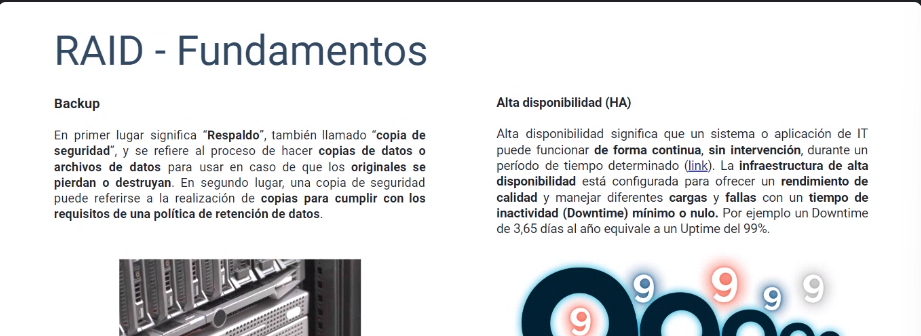
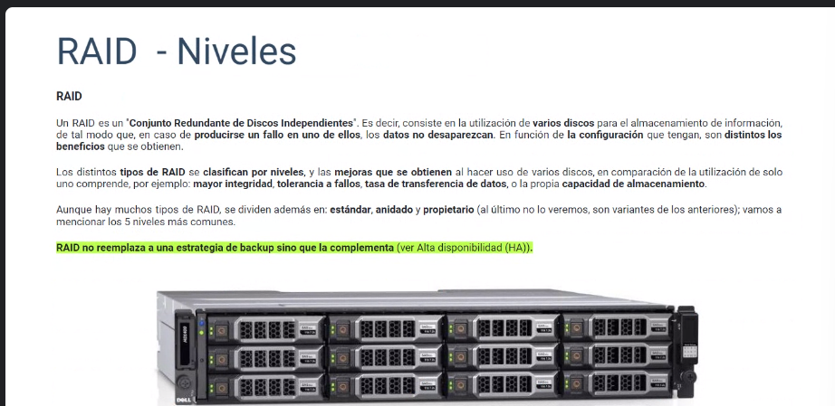
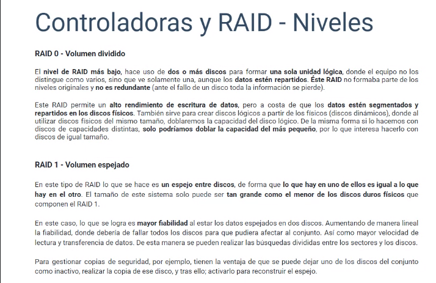
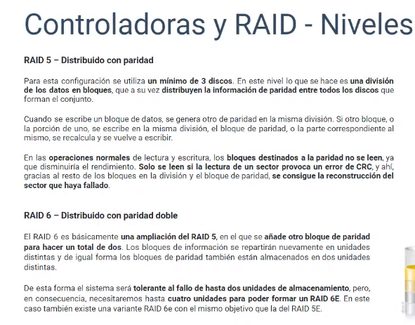
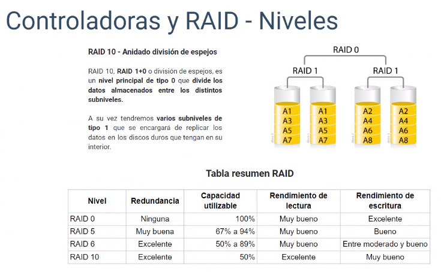

# Almacenamiento

## Controladoras de disco

La funcion de un controlador de disco es traducir las intrucciones de la computadora en algo q el dispositvo de almacenamiento pueda entender y viceversa.

Consiste en una placa de expansion

En dispositovos como servidores, existen placas dedicadas que pueden consolidar grandes cantidades de dispositivos de almacenamiento, incluso pueden consolidar varios discos fisicos en un unico disco logico con fin de alta disponibilidad. este tipo de especificacion se la denomina disco raid logico o arreglo de discos raid

## Raid fundamentos

### Redundancia

El raiid 0 cada dato que viene se segmenta.

