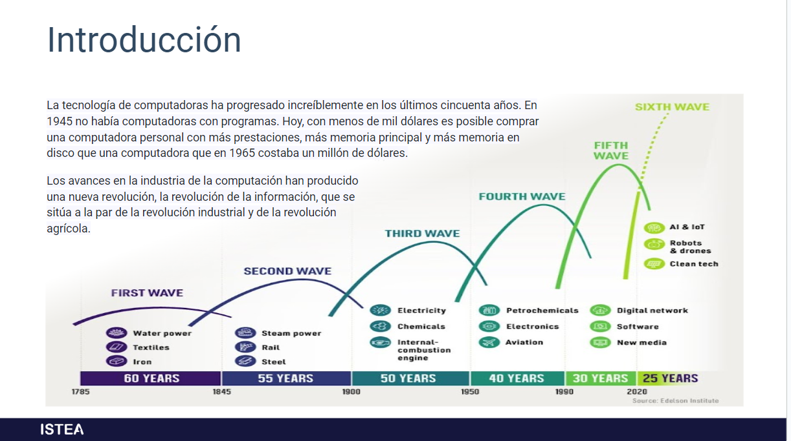

# Arquitectura de computadoras

## Definicion

Arquitecto: Supremo constructor

Computo: Calculo par averiguar el valor de algo, comparando y analizando datos.

Arquitectura: Construccion suprema

Computadoras: Maquinas de computo

## Funcionamiento de una computadora

Dato, informacion nos podemos referir como input y output

- para procesar datos necesitamos dos elementos: Computadora y programa.

La computadora es la máquina que realiza, electrónicamente, las operaciones. Sus partes son los componentes físicos o tangibles que llamamos hardware. Los programas (software), son elementos **intangibles**, que controlan las operaciones que realiza la computadora para procesar los datos.

## Hardware de la computadora

El hardware de la computadora puede defirnirse como todas aquellas partes fisicas o materiales que podemos ver o tocar

Por ejemplo:

1. Monitor
2. Teclado
3. Mouse
4. Disco duro
5. Gabinete

## Software

**Conjunto de instrucciones** que las computadoras emplean para **manipular y procesar datos**.

Sin el software, la computadora sería un conjunto de dispositivos físicos sin utilidad.

## Software del sistema

El software de sistema es un tipo de aplicación que permite que la información procesada por los softwares productivos o de aplicación se transforme en instrucciones entendibles para los componentes del hardware. Es decir, su función es comunicar los elementos del hardware con los distintos programas que utilizamos para ejecutar tareas específicas.

En esta categoría se encuentran, entre otros, **los controladores de dispositivos y los sistemas operativos**. En la actualidad, los sistemas operativos más usados son Windows, Linux, MacOS, Android e iOS.
