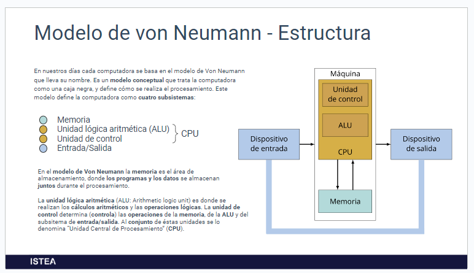

# Modelo de von Neumann

John von Neumann fue un matemático de origen húngaro que trabajó en el Proyecto Manhattan, cuyo objetivo fue el desarrollo de la bomba atómica de Estados Unidos durante la Segunda Guerra Mundial.

El trabajo requería un gran volumen de cálculos matemáticos: von Neumann contribuyó al desarrollo de computadoras cuyos programas se almacenaban en memoria, estableciendo la base de las arquitectura moderna.

- En la memoria se guardan el programa y los datos

- La CPU **(ALU y unidad de control)**: es la que se encarga de procesar todo para llegar a la salida

## Modelo de von neumann en la actualidad

- Placa Madre (Motherboard)
  Es la plaqueta de circuitos impresos (PCB) que sirve como medio de conexión fìsica entre el Procesador, el Chipset, la Memoria RAM, el BIOS, los puertos de entrada y salida, las ranuras de expansión y componentes electrónicos de soporte.

- Procesador (Microprocesador, CPU)
  Es el componente central (CPU) que recibe las instrucciones de un programa informático, las procesa mediante la realización de operaciones básicas aritméticas y lógicas, y entrega el resultado de ese proceso al sistema.

- Memoria (RAM)
  Es el componente de almacenamiento volátil, que guarda temporalmente información utilizada por la CPU mientras la computadora está siendo usada. La información almacenada en la memoria RAM se pierde cuando la computadora se apaga .

  RAM stands for random access memory, and it’s one of the most fundamental elements of computing. RAM is a temporary memory bank where your computer stores data it needs to retrieve quickly. RAM keeps data easily accessible so your processor can quickly find it without having to go into long-term storage to complete immediate processing tasks.

- Almacenamiento (Storage, Disco)
  Es el componente de almacenamiento no volátil, que mantiene guardados los programas y los datos aún con la computadora apagada. Comúnmente son Discos Duros (HDD) o Disco de Estádo Sólido (SSD).

- Gabinete (Chásis)
  Es la estructura cuya función es alojar y proteger la mayoría de los componentes de una computadora, y suele incluir la Fuente de Alimentación. Brinda seguridad estructural a los componentes que aloja, y realiza la administración térmica entre el interior y el exterior del mismo.
