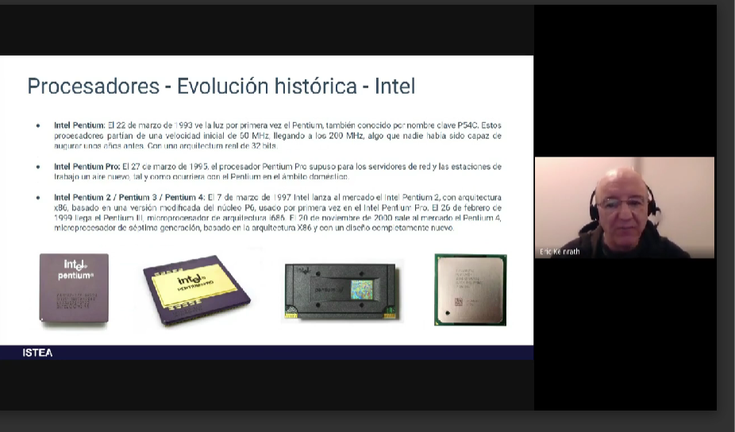
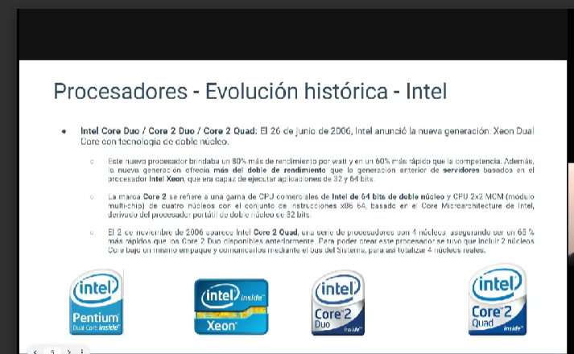
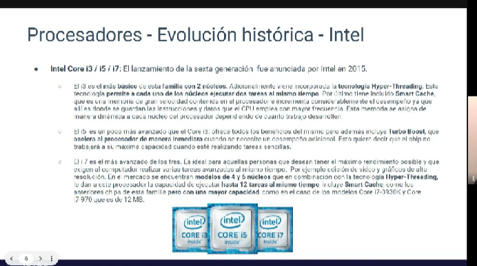
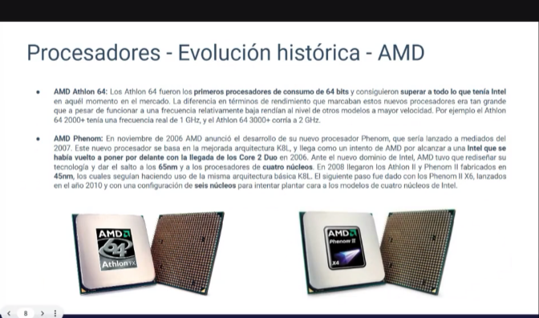
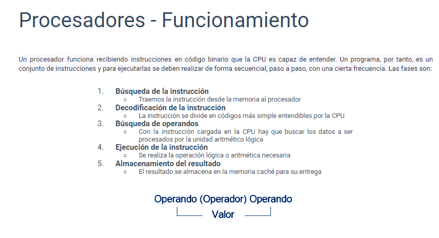
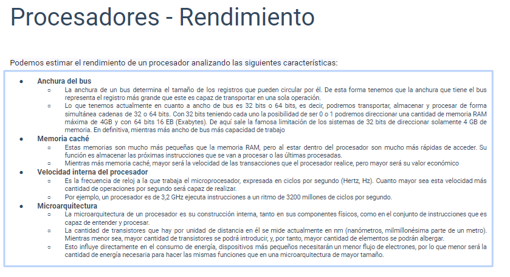
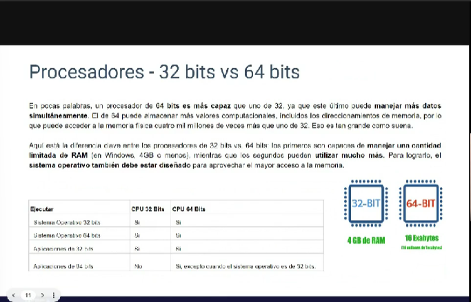

# Procesadores

## Evolucion historica

los ccomponentes electronicos utilizados para crear un procesador fueron evolucionando a lor largo del tiempo, comenzaron siendo valvulas de vacio y pasaron a ser transistores de silicio

- intel lanza el primer procesador 4004 en 1971

- las primeras computadores utilizan la capacidad de los transistores, para dejar pasar o no la corriente electrica para representar numero binarios, siendo 1 cuando circula corriente

- se diseñaban circuitos digitales, con eso se logro que pudieran hacer operaciones matematicas basicas como logicas

## Componentes de los procesadores

### Encapsulado

El encapsulado es la parte externa microprocesador, que protege la parte interna formada de silicio (nùcleo o chip)
Protege la parte del núcleo del deterioro y la oxidación externa
Enfría el núcleo para evitar la acumulación de calor, transfiriendo éste hacia el exterior
Sirve como soporte de las patillas de conexión

### Unidad de control

Unidad de control (UC)
La tarea fundamental de la UC es recibir información para interpretarla y procesarla mediante las órdenes que envía a los otros componentes. Para realizar todas estas operaciones, la UC dispone de pequeños espacios de almacenamiento de memoria interna, denominados registros.

### Registros

Son pequeños espacios de memoria que se encargan de tomar los datos de los programas de software y procesarlos en función de los comandos que hayan sido proporcionados. Los registros de un microprocesador son necesarios ya que en ellos se encuentran todos los valores, los comandos, estados binarios y cualquier otra instrucción para llevar a cabo el procesamiento de datos.

### Memoria Caché

Es un tipo de memoria ultrarrápida que está dentro del procesador y es empleada por éste para resolver operaciones previstas en su funcionamiento interno. Por ende, está encapsulada dentro del mismo procesador y opera en varios niveles (L1 L2 y L3).

### ALU

(UAL o coprocesador matemático)
La parte del procesador especializada en la resolución de cálculos matemáticos y lógicos.

## Procesadores funcionamiento

## Procesadores rendimiento

## Procesadores e 32 y 64 bits

Los procesadores de 32 y 64 bits se refieren a la arquitectura de los microprocesadores, que determina la cantidad de datos que pueden procesar en un solo ciclo de reloj. Aquí te explico cada uno:

Procesadores de 32 bits:

Estos procesadores pueden manejar datos y direcciones de memoria en bloques de 32 bits a la vez. Esto significa que pueden acceder a 2^32 direcciones de memoria diferentes, lo que equivale a aproximadamente 4 gigabytes de RAM (ya que cada dirección de memoria representa un byte).
Los sistemas operativos y software diseñados para arquitecturas de 32 bits están optimizados para trabajar con procesadores de este tipo.
Procesadores de 64 bits:

Los procesadores de 64 bits pueden manejar datos y direcciones de memoria en bloques de 64 bits a la vez. Esto les permite acceder a una cantidad enormemente mayor de direcciones de memoria (2^64 direcciones).
Esto significa que los sistemas basados en procesadores de 64 bits pueden teóricamente soportar una cantidad masiva de RAM, mucho más allá de lo que la mayoría de las aplicaciones y sistemas operativos pueden utilizar actualmente.
Los sistemas operativos y software diseñados para arquitecturas de 64 bits pueden aprovechar al máximo esta capacidad.
La principal ventaja de los procesadores de 64 bits es su capacidad para manejar grandes cantidades de memoria RAM. Esto es especialmente importante en sistemas que realizan tareas intensivas en cuanto a recursos, como la edición de video o la ejecución de aplicaciones científicas.

Además, los procesadores de 64 bits pueden manejar datos de manera más eficiente en algunas situaciones específicas, especialmente cuando se trata de números muy grandes.

Sin embargo, para aprovechar al máximo un procesador de 64 bits, es necesario tener un sistema operativo y software diseñado específicamente para esta arquitectura. A partir de mi última actualización en septiembre de 2021, la mayoría de los sistemas operativos modernos y software populares están disponibles en versiones de 64 bits.

Es importante señalar que si tienes un procesador de 64 bits, generalmente puedes ejecutar software de 32 bits en él, aunque no siempre ocurre al revés (es decir, no todos los sistemas de 32 bits pueden ejecutar software de 64 bits).
