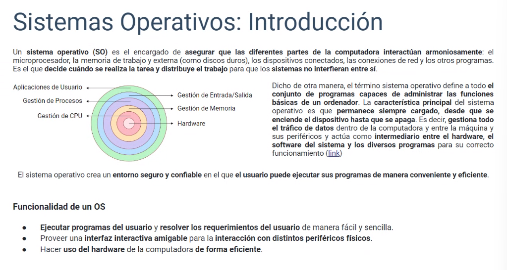

# Sistemas operativos

## introduccion

## Tipos de sistema operativos

todos los dispositivos necesitan un so, no todos los dispositivos manejan el mismo lenguaje. existe diferentes tipos de sistemas operativos:

- en tiempore real: son utilizado en automoviles
- de tarea unico: son para dispositivos de un solo usuario como los moviles
- multitarea y usuario unico: para ordernadores personales
- multiusuario: se utilizan en redes cuando varios usuarios comparten un recurso, por ejemplo, un servidor
- de red: se utiliza para compartir archivos, como una impresora en una configuracion de red
- internet/ so web: sirve para ejecutarse en un navegador cuadno se esta en linea
-
