# Como subir un proyecto React a Github

## Que es Git?

Git es un sistema de control de versiones, esto quiere decir que git nos permite gestionar y rastrear los cambios realizados en un conjunto de archivos a lo largo del tiempo. su objetivo principal es mantener un historial completo de las modificaciones realizadas en un proyecto.

Git crea un clon local del proyecto, estos repositorios locales nos permiten trabajar sin oonexion y de forma remota. una vez que confirmamos los cambios de nuestro proyecto, podemos subir estos cambios a un repositorio remoto en el servidor de github.

## Ventajas de usar Git

- Desarrollo simultáneo: Todos los desarrolladores tienen su propia copia local de código y pueden trabajar simultáneamente en sus propias ramas. Git funciona sin conexión, ya que casi todas las operaciones son locales. esto facilita trabajar en equipo y evitar conflictos.

- Volver atrás en el tiempo: Si se comete un error o se desea regresar a una versión anterior del proyecto, es posible hacerlo utilizando las confirmaciones previas almacenadas en el historial.

- Rastrear cambios: Pueden ver en detalle qué modificaciones se han realizado en el código en cada confirmación.

<!-- 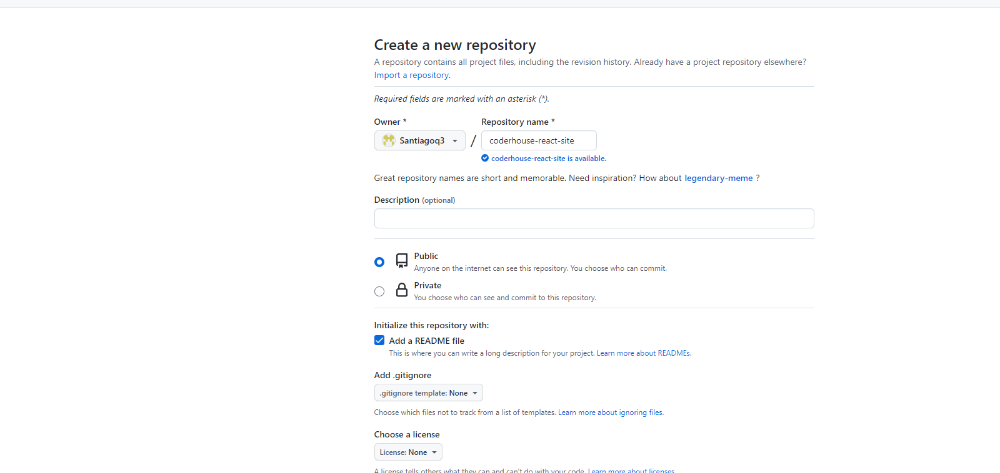 -->

<!-- Add **Markdown or React** files to `src/pages` to create a **standalone page**: -->

<!-- <!-- - `src/pages/index.js` → `localhost:3000/` -->

## Creando un repositorio remoto en github

1- Debemos diriginos a [https://github.com/new](https://github.com/new) para crear un repositorio con nuestra cuenta.

Nos mostrara esta pantalla, agregamos un nombre al repo y tenemos otras opciones para agregar.

**Deshabilitemos el checkbox Add a Readme file**

Una vez con los datos completados, damos click en Create repository


2- Nuestro repositorio ya esta creado, ahora debemos ejecutar los comandos que Github nos da.

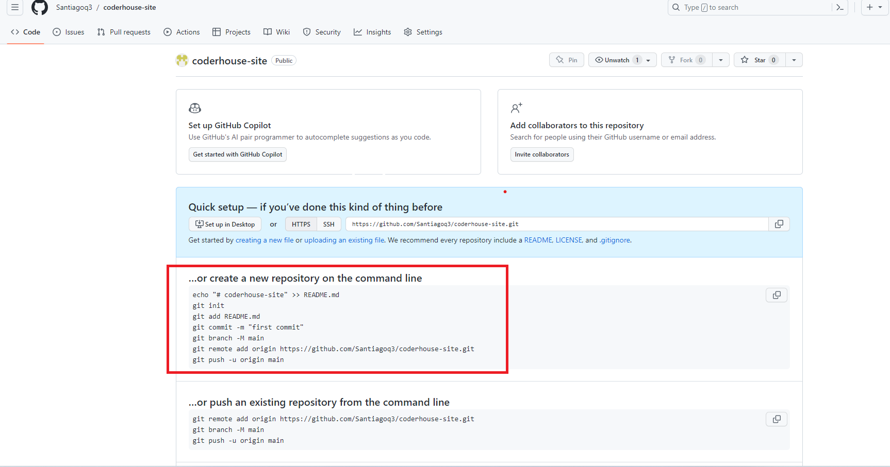

**Lista de comandos:**

```bash
git init
```

### Git init

**Git init** se utiliza para iniciar un nuevo repositorio de git en un directorio vacio. Cuando ejecutas este comando en un directorio, Git crea un nuevo repositorio vacío en esa ubicación y comienza a rastrear los cambios en los archivos dentro de ese directorio. Git crea un historia de los archivos creando una carpeta oculta .git

Nos dirigimos a la terminal y nos paramos en el directorio de nuestro proyecto.

Ejecutando el comando

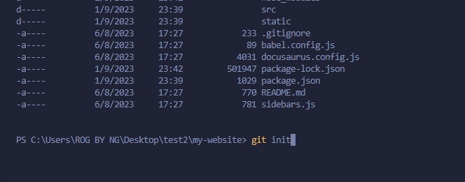

Despues de haber ejecutado el comando

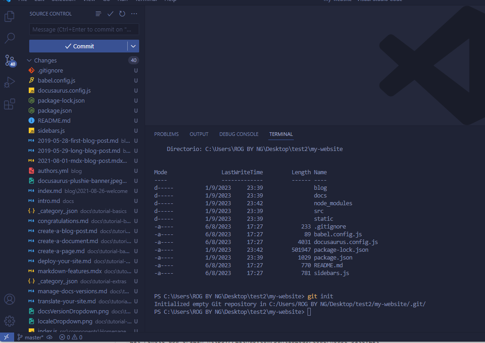

### **Comando Git add .**

```bash
git add .
```

Es cierto que en la imagen aparece git add README.md, pero utilizaremos este comando para agregar todos los archivos.

El comando **git add .** se utiliza para agregar todos los cambios en el directorio al area de **staged**.

El staged es una etapa intermedia en git que te permite seleccionar que cambios especificos deseamos incluir en el commit.

Ejecutando el comando git add .
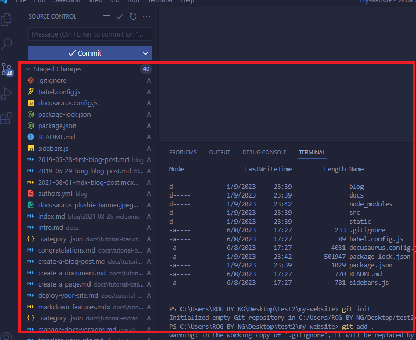

Despues de haber ejecutado el comando, podemos ver que los archivos ya se encuentran en el area de staged.

### Git commit

El tercer paso es ejecutar el comando git commit

```bash
git commit -m "first commit"
```

Este comando se utiliza para confirmar los cambios que hemos realizado en el repositorio local.

el parametro -m "first commit" se utiliza para proporcionar un mensaje al commit. El mensaje se debe incluir entre comillas simples o dobles.

Cuando usamos este comando los cambios se registrarán en la historia del repositorio.

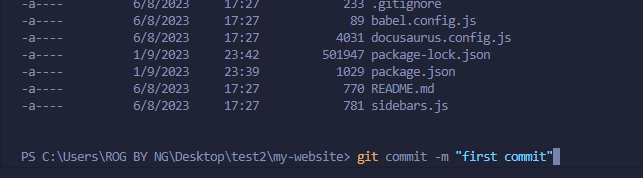

### Git Branch -M main

```bash
git branch -M main
```

El comando "git branch -M main" se utiliza para renombrar la rama actual de tu repositorio Git.

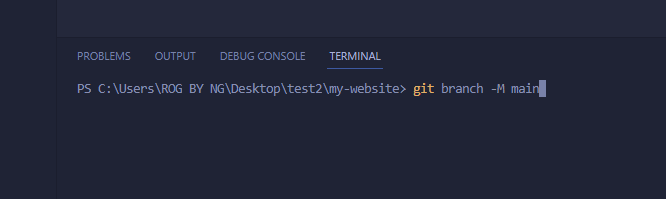

### Git remote add origin

```bash
git remote add origin
```

El comando "git remote add origin" se utiliza para establecer una conexión entre el repositorio Git local y un repositorio remoto específico de Github.

Al comando git remote add origin debemos proveerle la URL del repositorio para poder establecer la conexion, esto es importante para poder realizar los push al repositorio remoto.

El comando podria verse asi:

```bash
git remote add origin https://github.com/tu-usuario/tu-repositorio.git
```

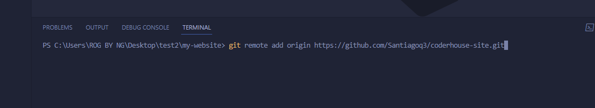

### Git Push

```bash
git push -u origin main
```

El comando "git push" se utiliza para enviar tus cambios (commits) locales a un repositorio remoto. Este comando sincroniza las modificaciones que has realizado en tu rama local con la rama correspondiente en el repositorio remoto. Aquí está cómo funciona:

El comando "git push -u origin main" tiene dos partes principales:

"git push": Como mencioné anteriormente, este comando se utiliza para enviar tus cambios locales a un repositorio remoto.

- "-u origin main": Estos son argumentos que se utilizan en conjunto con el comando "git push":

- "-u": La opción "-u" significa "set-upstream"en Git. Cuando utilizas "-u" junto con "git push", le estamos diciendo a Git que establezca una relación de seguimiento entre la rama local que estás empujando (en este caso, "main") y la rama en el repositorio remoto que estás empujando hacia (en este caso, "origin/main"). Esto significa que, en futuros comandos "git push" o "git pull", no tendrás que especificar explícitamente la rama local y el repositorio remoto; Git recordará automáticamente la configuración.

- "origin": Es el nombre del repositorio remoto al que estás enviando tus cambios. Por convención, "origin" se utiliza como el nombre predeterminado para el repositorio remoto principal, pero podría tener un nombre diferente si se configuró de esa manera.

- "main": Es el nombre de la rama local que deseas empujar al repositorio remoto "origin" en este caso.

Ejecutando el comando

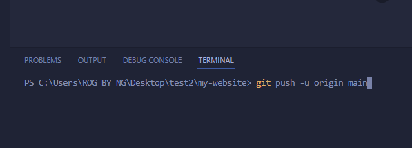

Despues de ejecutar el comando

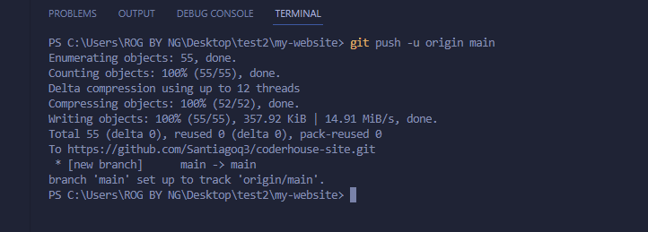

## Ver nuestro repositorio remoto

Despues de ejecutar el comando git push, el repositorio remoto deberia estar actualizado. Nos dirigimos a Github y recargamos la pagina.

Podemos ver que los archivos del proyecto se subieron correctamente

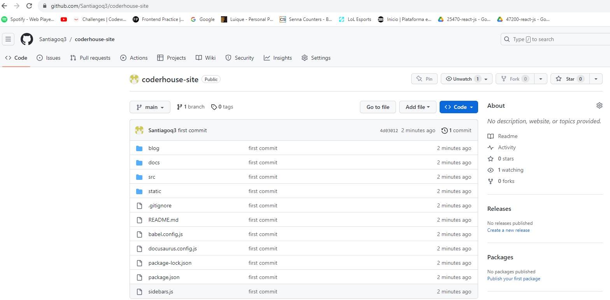

Ahora solo nos queda seguir trabajando en nuestro proyecto local, y cuando queramos subir nuestro cambios debemos:

1. Subir al staged los cambios (git add)
2. Confirmar los cambios (git commit)
3. Subir los commit al repositorio remoto (git push)
