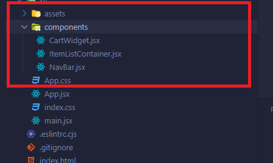
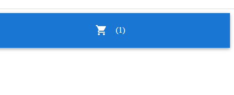
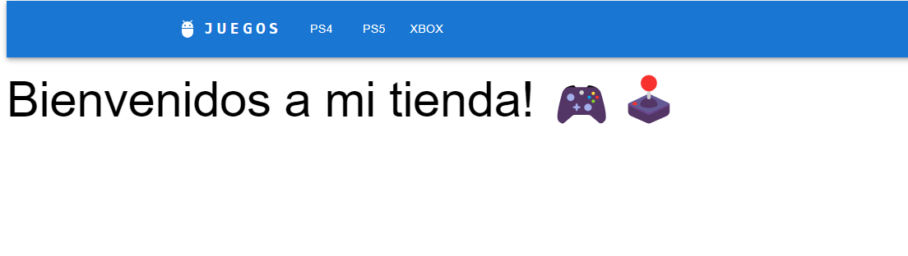

# Primera pre-entrega de tu Proyecto final

## Formato de entrega

El formato de entrega a traves de un repositorio en github, puedes buscar en la guia de github sobre como subir tu proyecto react a github

## Consignas

### Crear el componente Navbar.jsx

- **Objetivos:** Crear el menú e-commerce de tu proyecto.

- Crea una carpeta dentro de src llamada components que contenga el archivo `src/components/NavBar.jsx` . Su funcionalidad es la de renderizar una barra de menú (Navbar).



#### Que es un Navbar?

Es un menu de navegacion, que nos permite acceder a otras secciones de manera mas rapida.

Ejemplos:

- [https://getbootstrap.com/docs/4.0/components/navbar/](https://https://getbootstrap.com/docs/4.0/components/navbar/) copia esta url y pegala
- [https://mui.com/material-ui/react-app-bar/](https://mui.com/material-ui/react-app-bar/)
- [https://www.w3schools.com/css/css_navbar.asp](https://www.w3schools.com/css/css_navbar.asp)

:::info Info

Puedes usar CSS vanilla, SASS, o cualquier otra libreria de estilos

:::

**Asegurate de agregar esto:**

- Brand (título/nombre de la tienda)
- Un listado de categorías clickeables. Imaginemos que tenemos una tienda de ropa, categorias pueden ser: Ropa Mujer, Ropa Hombre, Ropas Niños, etc...
- Incorpora alguna librería de estilos con bootstrap/Material ui u otro de tu preferencia **OPCIONAL**.

### Crear el componente CartWidget.tsx

- **Objetivos:** Renderizar una imagen con un carrito y un numero que representa la cantidad de productos añadidos en el carrito.

- Crea un componente CartWidget `src/components/CartWidget.jsx` con un ícono y una notificación mostrando un número hardcodeado (fijo). Este servirá luego para indicar la cantidad de productos que tenemos en el carrito, pero por ahora, mostrará un número hardcodeado (colocado en el código). Ubica este componente (CartWidget) dentro de `src/components/NavBar.jsx`.

Esto deberia lucir de esta manera:



### Crear el componente ItemListContainer.tsx

- **Objetivos:** Crear la landing de tu proyecto y mostrar un mensaje de bienvenida.

- Crea un componente contenedor ItemListContainer.js `src/components/ItemListContainer.jsx` con una **prop greeting**, y muestra el mensaje dentro del contenedor con un styling agregado.

```jsx title="src/App.jsx"
<ItemListContainer greeting={"Bienvenidos a mi tienda! 🎮🕹️"} />
```

#### Que son las props?

Son parametros/valores de entrada que enviamos a nuestros componentes, son una forma de compartir informacion, para que nuestros componentes pueden o no utilizar para realizar x logica.

En este caso el objetivo de la prop greeting es utilizarse para mostrar un mensaje.

Que podemos enviar en las props?

- Numeros, strings, Arrays, objetos, incluso hasta componentes

:::info Props
Si enviamos la prop greeting:

```jsx title="src/App.jsx"
<ItemListContainer greeting={"Bienvenidos a mi tienda! 🎮🕹️"} />
```

Al momento de recibirla por desestructuracion debemos hacerlo con el mismo nombre que le enviamos

```jsx title="src/App.jsx"
const ItemListContainer = ({ greeting }) => {};
```

:::

**Esto podria verse de esta manera:**



## Se debe Entregar

- Crea un componente CartWidget.js que haga rendering de un ícono Cart, e inclúyelo dentro de NavBar.js para que esté visible en todo momento.
- Crea un componente ItemListContainer. **Impórtalo dentro de `src/App.jsx`, y abajo de `<NavBar />`**.
