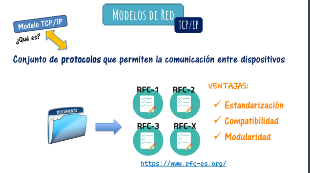
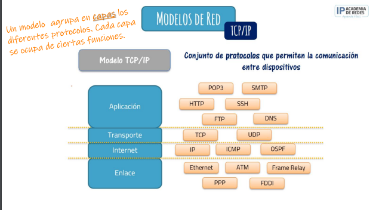

# Modelos de red

## Que es un modelo de red?

Conjunto de documentos que definen el funcionamiento de una red

- OSI
- DEC
- TCP-IP

- Hay que tener en cuenta que una red de un modelo no era compatible con una red de otro modelo.

- Finalmente el modelo que se acabó imponiendo a todos los demás fue el modelo TCP IP

## Modelo TCP IP

Conjunto de protocolos que permiten la comunicacion entre dispositivos

- Segmentamos el modelo en diferentes partes/ capas en funcion en funcion de la tarea de cada protocolo

-
